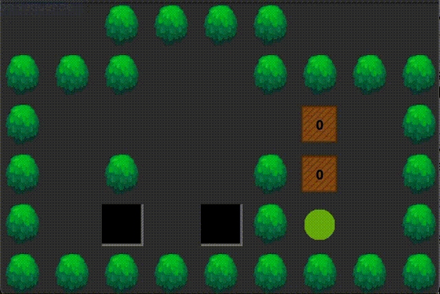
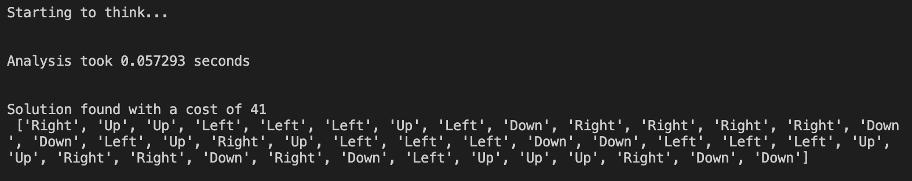
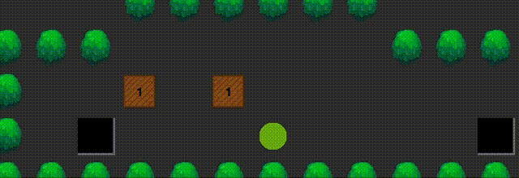
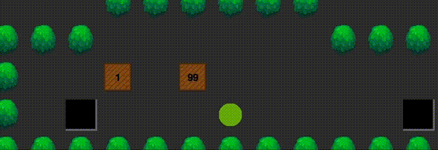

# Sokoban Game AI

Solving Sokoban game using Artificial Intelligence using State space search

<!-- ABOUT THE PROJECT -->
## About The Project
<!-- screenshot -->

This was a university assignment to implement the weighted version of classic [sokoban](https://en.wikipedia.org/wiki/Sokoban) game and solve the game in the least amount of moves.

GUI feature is provided by the assignment. The main task is to implement 'mySokobanSolver.py'.


## Variant
<!-- variant -->

This variant of Sokoban takes account of the weight of boxes in addition to move cost. The goal of the puzzle is to find the least cost to find the goal state.

## Installation
<!-- installation -->

Clone the repo.

```sh
   git clone https://github.com/hikariakio/sokoban-python-ai
   cd sokoban-python-ai
   ```
   
Start GUI-mode.

```sh
    python gui_sokoban.py
```

## Usage
<!-- usage -->

### How to play

* Before playing a game, loading a warehouse is required.  From the menu bar,
```
 File > Load warehouse > choose any desired map.
```
* Then use arrow keys to move the player. 

* Player can only push a box at a time. 

* The game will over when all boxes are in target locations.

* 'r' key can be pressed anytime to reset the whole puzzle.


### AI Play

AI can help you to solve the puzzle at any point. From the menu bar,

```
Solve > Plan action sequence
```

AI will generate the solution based on the current game state. More information can be found in terminal. You can manually play the solution by yourself or you can order AI to play.

```
Solve > Play action sequence
```

*AI calculation duration depends on the size of map and number of boxes. If there is no valid solution,error message will be shown on terminal.*

### Screenshots





## Warehouse Map

| Symbol       | State      |
| ---          | -----      | 
|#|Tree
|$|Box
|.|Target
|@|Player
|!|Player on Target
|*|Box on Target

Warehouse map of the above puzzle.

```
  ####
 ###  ####
 #     $ #
 # #  #$ #
 # . .#@ #
 #########
 ```
 <!-- WEIGHT Variant -->
## Weight Variants

AI will try reduce the cost as much as it can when pushing weighted boxes.

* Normal        

* Weighted


*Box with weight 99 will be prioritized to the nearest target.*


 <!-- LICENSE -->
## License

Distributed under the MIT License.

## Acknowledgement

* Icon images from Risto Stevcev
* Scaffold Template from QUT IFN680 Assignment1
